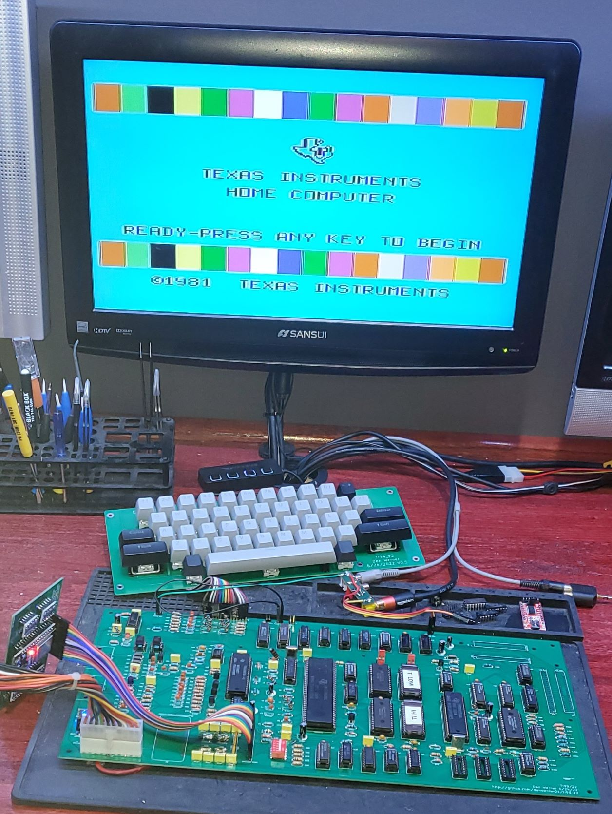

# Texas Instruments TI99/4A Clone(ish) Project

Note that this is not a fully tested project at this point. . . .

This is based Rob Krenicki's design that is based on the HackMac KiCAD schematics.  I have made several changes to the original design including:

* Placing 32K of 16bit wide fast ram on the board to fully populate the address space
* Placing an EPROM on the main board that can be used as an on-board cartridge ROM
* adding a header to allow a microcontroller to replace the GROM chips (hopefully this can be moved on-board soon)
* replacing the video DRAM with SRAM
* Updating the Keyboard header to support a soft caps lock switch on the keyboard PCB
* designing a Cherry MX keyboard
* adding headers for the GROM and expansion port to support riser cards for these ports

If there are any questions, I can be reached at vic2020Dan at gmail dot com.

## ToDo
* Cleanup/Documentation
Possible Future Thoughts:
* Redo the Board in an ATX form factor with PEB slots on board
* Add Support for the Pico9918 on-board
* Add Support for a Tang Nano FPGA TMS9918 replacement 
* Add Hex-bus port
* Add a DIN 5-pin Composite video/Audio out. 
* Add built in speech synthesis
* Clone Disk IO card
* Relocate all the ports to the back of the motherboard

* It has been suggested that we also have a console style version of the next revision as not everyone has a desire for a larger PE style machine
* Also perhaps add some keys to the keyboard

## DIP Switch Settings
The DIP switch on the main board allows one to configure which bank areas are populated with RAM.
 

RAM0 enables RAM to addresses >2000-3FFF (Lo Memory Expansion)
RAM1 enables RAM to addresses >A000-BFFF (Hi Memory Expansion)
RAM2 enables RAM to addresses >C000-DFFF (Hi Memory Expansion)
RAM3 enables RAM to addresses >E000-FFFF  (Hi Memory Expansion)
RAM4 enables RAM to addresses >8000-83FF (Normal TI Scratch Pad RAM)

Note that I have never actually tested off-board 8 bit RAM, so this is new territory and might need some debugging 😊   
also on-board RAM is 16 bit – so all of those external RAM sources will be slower. 

## Bugs
* on rev 0.95 R36-40 are listed as 100K ohm, they are actually 100 ohm
* on rev 0.95 the joystick and cassette connectors are mirrored and need to be mounted on the bottom side of the board to function
* Both of these are corrected in 0.96

* The reset button J1 should be attached to pin 5 of U1 not Pin 4

## Bill of Materials
### Console
Qty|Reference(s)|Part
---|------------|----
6|C1, C9, C11, C58, C73, C75|0.001uF
1|C2|22pF
3|C3, C5, C59|22uF
12|C4, C7, C13, C14, C20, C54, C55, C62, C64, C68, C71, C74|0.1uF
1|C6|1uF
7|C8, C52, C63, C65, C66, C67, C72|0.01uF
1|C10|100uF
1|C12|0.01uF
7|C15, C16, C17, C19, C21, C22, C60|100uF
30|C18, C23, C24, C25, C26, C27, C28, C29, C30, C31, C32, C33, C34, C35, C36, C37, C38, C39, C40, C41, C42, C43, C44, C45, C46, C47, C48, C49, C50, C51|0.1uF
1|C53|100uF
1|C56|12pF
1|C57|56pF
1|C61|220uF
1|C69|220pF
1|C70|0.022uF
2|CR1, CR4|1N4148
2|CR2, CR3|1N914B
1|D1|LED
1|J1|Connector PinHeader 2.54mm:PinHeader 1x02 P2.54mm Vertical
1|J2|Connector PinHeader 2.54mm:PinHeader 1x02 P2.54mm Vertical
1|J3|TerminalBlock RND:TerminalBlock RND 205-00278 1x04 P5.00mm Vertical
1|J4|Connector PinHeader 2.54mm:PinHeader 1x16 P2.54mm Vertical
2|J5, J6|Connector PinHeader 2.54mm:PinHeader 1x03 P2.54mm Vertical
1|J7|Connector PinHeader 2.54mm:PinHeader 1x03 P2.54mm Vertical
1|J8|Connector PinHeader 2.54mm:PinHeader 1x02 P2.54mm Vertical
1|J9|Connector PinHeader 2.54mm:PinHeader 1x02 P2.54mm Vertical
1|J10|Connector Dsub:DSUB-9 Female Horizontal P2.77x2.84mm EdgePinOffset4.94mm Housed MountingHolesOffset7.48mm
1|J11|Connector PinHeader 2.54mm:PinHeader 1x18 P2.54mm Vertical
1|J12|Connector PinHeader 2.54mm:PinHeader 2x22 P2.54mm Vertical
1|J13|WernerCustomLibrary:44 Pin Card Edge
1|J14|Library:CardEdge 34Pin 2.54mm Vertical
1|J15|Connector PinHeader 2.54mm:PinHeader 2x18 P2.54mm Vertical
1|J16|Connector PinSocket 2.54mm:PinSocket 1x03 P2.54mm Vertical
1|J17|Connector PinSocket 2.54mm:PinSocket 1x03 P2.54mm Vertical
1|J18|Connector Dsub:DSUB-9 Female Horizontal P2.77x2.84mm EdgePinOffset4.94mm Housed MountingHolesOffset7.48mm
1|L1|0.33uH
2|L4, L5|6.8uH
1|L7|5.8uH
1|L8|INDUCTOR (Ferrite BEAD)
7|L10, L11, L12, L13, L14, L15, L16|8.2uH
3|Q1, Q3, Q4|TIS92
1|Q2|2N3904
1|R1|150k
7|R2, R9, R11, R18, R34, R35, R46|1k
1|R3|12k
1|R4|47k
4|R5, R6, R7, R8|22
5|R10, R26, R45, R52, R53|4.7k
5|R12, R13, R14, R15, R16|1K
3|R17, R48, R50|2.2k
2|R19, R30|470
1|R20|270
1|R21|1.5k x 9 SIP bussed
1|R22|361
3|R23, R73, R75|5.6k
2|R24, R27|10
1|R25|150
1|R28|470k
1|R29|0
2|R31, R33|75
1|R32|470
4|R41, R42, R43, R44|62
1|R47|3.3k
9|R36, R37, R38, R39, R40, R49, R51, R54, R56|100
1|R55|330
1|R57|10k
1|R58|6.8k
1|R59|39k
1|R60|6.8k
4|R61, R62, R67, R68|1K
1|R63|120k
1|R64|2.7k
3|R65, R66, R76|220
1|R69|10K
1|R70|9.1k
2|R71, R72|10k
1|R74|5.6K
1|R77|15
2|RN1, RN2|10K x 9 SIP Bussed
1|SW1|DIP switchx05
1|SW2|Pin Header 01x02 Male
1|U1|TMS9904 (note this needs to be a 9904 not 9904ANL.  If the 9904ANL is used, Y1 needs to be substituted with 12Mhz, L1 needs to be substituted with 3.3uh and C2 needs to be substituted with 50pf)
1|U2|TMS9900
4|U3, U15, U22, U24|74LS04
2|U4, U9|74LS32
2|U5, U8|74LS138
1|U6|74LS03
1|U7|74LS08
3|U10, U14, U18|74LS00
2|U11, U41|74LS244
1|U12|74LS373
1|U13|74LS245
1|U16|74LS74
1|U17|74LS194
1|U19|LM2901
1|U20|LM7905 TO220
1|U21|LM2903
3|U26, U27, U28|TMC0430
3|U29, U30, U37|HM62256BLP
2|U31, U32|27C64
1|U33|SN76489
1|U34|TMS9918
3|U35, U36, U38|74LS574
1|U39|TMS9901
1|U40|74LS156
2|U42, U43|74LS367
1|U44|74LS379
1|U45|27C010
1|U46|RC4558
1|U47|74LS06
2|U48, U49|TIL119
1|Y1|48.000 MHz Crystal
1|Y2|10.7MHz Crystal

# Keyboard
Qty|Reference(s)|Value|Part
---|------------|-----|----
1|C1|0.1uF|Capacitor
1|D1|LED|LED
1|D2|LED|LED
1|J1|Pin Header 1x18 male|Pin Header 1x18 male
2|R1, R2|470 ohm|Resistor
1|R3|1K ohm|Resistor
48|SW1-SW48|Mechanical Switch|Cherry MX Switch (or compatible)
1|U1|ATtiny13A-P|IC
1|U2|74LS125|IC
3||Switch Stabilizer 2.25|
1||Switch Stabilizer 6.25|
1||Optional Alignment frame (will need modified)|
|||
|Stabilizers (frame not used):|https://www.amazon.com/Genuine-Cherry-PCB-Snap-Stabilizers/dp/B085T8QZJC|
|Stabilizers (Frame used)|https://www.amazon.com/dp/B082X4V9VC|
|Frame:|https://www.amazon.com/gp/product/B07MMB33WG|

# Cartridge Riser
Qty|Reference(s)|Part|Type
---|------------|----|----
1|J1|Pin Header 01x18 Male|Pin Header 01x18 Male
1|J2|36 Pin Edge Connector|CONN EDGE DUAL FMALE 36POS 0.100 spacing

# IO Riser
Qty|Reference(s)|Part|Type
---|------------|----|----
1|J1|Pin Header 2x22 Male|Pin Header 2x22 Male

# UNICORN BOARD
Qty|Reference(s)|Part|Type
---|------------|----|----
1|J1|Pin Header Socket 01x16 Female Right Angle|Pin Header Socket 01x16 Female Right Angle
4|U1-U4|Level Shifter|https://www.amazon.com/KeeYees-Channels-Converter-Bi-Directional-Shifter/dp/B07LG646VS
1|U5|ESP32 Devkit|https://www.amazon.com/Development-Microcontroller-Integrated-Antenna-Amplifiers/dp/B09GK74F7N

## License

The original project was licensed under the Creative Commons - Attribution - ShareAlike 3.0 License

## Attribution

This board was derrived from works by, uses design elements from, or contains sofware writen by the following:
* Rob Krenicki (https://github.com/rkrenicki/TI99-Motherboard)
* HackMac (https://bitbucket.org/hackmac/ti-schematics/wiki/Home)
